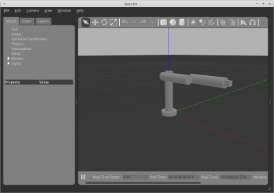
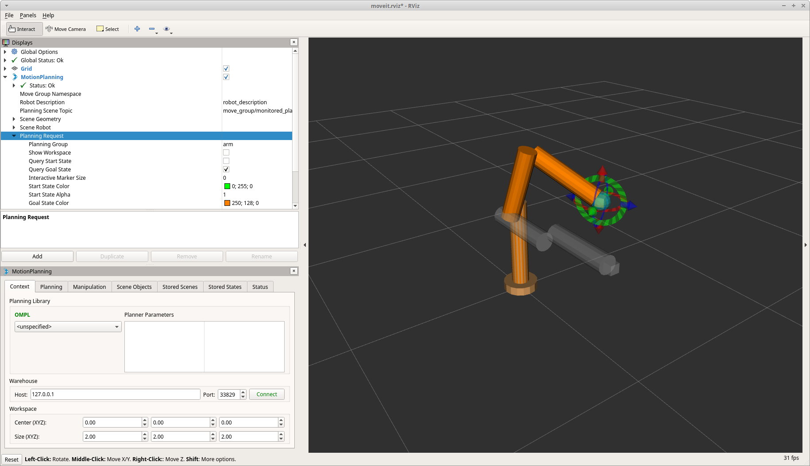

# Robotic arm playground

This is environment for robotic arm. It consists of simulation model and examples of control algorithms provided *MoveIt* platform.


## How to build:

To prepare environment execute *initialize_workspace.sh*. It's required only for first time.

To build/rebuild packages after making changes execute *make.sh*


## CougarBot

[*CougarBot*](#ref01) consists of four joints: hip, shoulder, elbow and wrist. It can bend three joints and rotate around base.
Code of the bot was taken from ["Programming Robots with ROS"](#ref02).


### Screens

[](doc/screens/cougarbot-gazebo.png)
[](doc/screens/cougarbot-rviz.png)

1. CougarBot viewed in Gazebo
2. CougarBot viewed in RViz


### How to run:

For every command listed below open new command line and start virtual environment by calling *startenv.sh*.
To run the environment execute:
1. start Gazebo simulation by *./src/cougarbot/start_gazebo.sh*
2. execute *MoveIt* solver by *./src/cougarbot_moveit_config/start_moveit.sh*
3. run RViz GUI by *./src/cougarbot_moveit_config/start_rviz.sh*

As an alternative, whole environment can be run at once by executing ```roslaunch cougarbot_moveit_config all.launch```


## Requirements

Environemnt was tested with following dependencies:
- ROS Melodic
- ROS MoveIt 1.0.2
- Gazebo 9.9.0
- Python 2.7.15+ (for ROS)


## Issues:

Following issues can occur:
- missing joint trajectory controller -- install package: ```ros-melodic-joint-trajectory-controller``` 
- RViz does not allow to change arm's state -- change command line environment locale variable by ```export LC_NUMERIC="en_US.UTF-8"```
- RViz allows to change arm's state only in one dimmension -- activate *MotionPlanning* option *Allow Approx IK Solutions*. It occurs because of 1-DOF wirst.


## References

<a name="ref01">[1]</a>: *CougarBot* [repository](https://github.com/osrf/rosbook)

<a name="ref02">[2]</a>: "Programming Robots with ROS" by Morgan Quigley, Brian Gerkey and William D. Smart, ISBN: 978-1-449-32389-9

